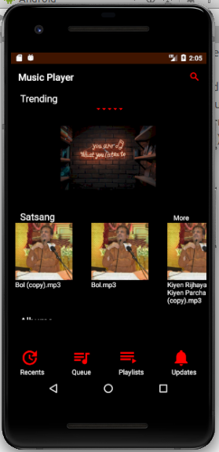
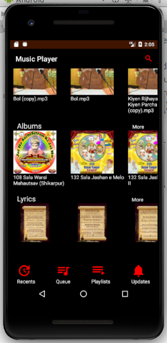
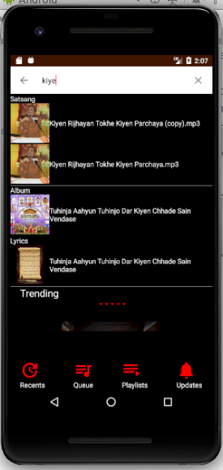
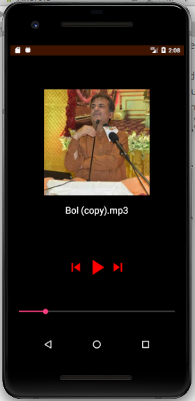
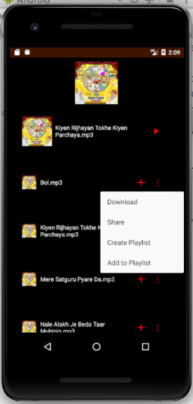
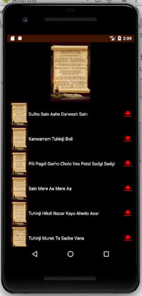
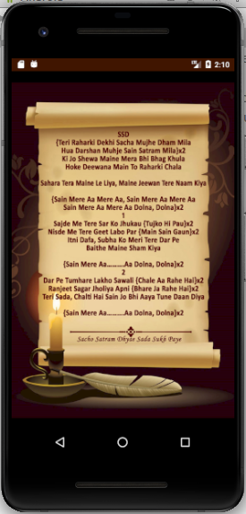

# Music-Streaming-App

# Server Code location
Keep the audio folder in /opt/lampp/htdoc folder in Ubuntu system. audio folder has the server code. In /audio/data/WebsiteSourceCode/ folder there will be many subfolders where a file named "mp3 files here" is there. Delete this file from all these subfolders and keep your mp3 files there. 

# Run the server 
First kill already running instance of apache2 server (it was causing problem in my system):

sudo lsof -i:80

sudo kill <pid>
 
 
Now start the apache server

sudo /opt/lampp/lampp start

Run ngrok command for port forwarding

ngrok http 80

Copy the url and paste it in Endpoints.java file like : 

public static final String SITE_URL = "http://fbd4de44.ngrok.io";

I have installed XAMPP server which has MySQL and Apache together. It is easier to use this way rather than installing them separately.

These two links helped a lot : https://www.sitepoint.com/develop-music-streaming-android-app/
https://stackoverflow.com/questions/14728945/play-stop-sound-from-another-activity
